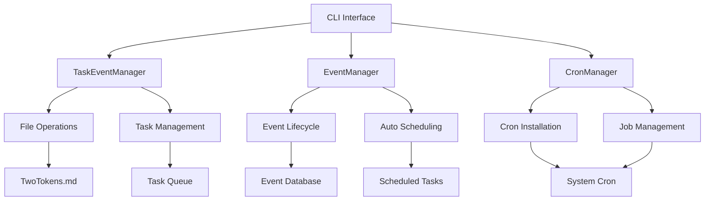

# TwoTokens Automation 🚀

[](https://choosealicense.com/licenses/mit/)
[](https://www.python.org/downloads/)
[](https://github.com/palash-devworks/TwoTokensAutomation)

A powerful command-line tool for automating event management, file updates, and task scheduling with intelligent cron job integration. Perfect for managing meetups, conferences, and recurring automation tasks.

## ✨ Key Features

<div class="feature-grid">
  <div class="feature-card">
    <h3>📅 Event Management</h3>
    <p>Create, track, and manage events with sponsors, directors, teams, and topics</p>
  </div>
  
  <div class="feature-card">
    <h3>🔄 Auto Scheduling</h3>
    <p>Generate pre-event and post-event tasks automatically</p>
  </div>
  
  <div class="feature-card">
    <h3>⏰ Cron Integration</h3>
    <p>Seamlessly schedule and manage cron jobs</p>
  </div>
  
  <div class="feature-card">
    <h3>📝 File Automation</h3>
    <p>Automated file management with timestamps</p>
  </div>
  
  <div class="feature-card">
    <h3>🔔 Smart Notifications</h3>
    <p>Automated reminders for stakeholders</p>
  </div>
  
  <div class="feature-card">
    <h3>📊 Activity Logging</h3>
    <p>Comprehensive logging with timestamps</p>
  </div>
</div>

## 🚀 Quick Start

### Installation

```bash
# Clone the repository
git clone https://github.com/palash-devworks/TwoTokensAutomation.git
cd TwoTokensAutomation

# Install dependencies
pip3 install python-dateutil

# Setup the system
./setup.sh
```

### Create Your First Event

```bash
./twotokens event add "Summer Tech Meetup" "2025-08-15 18:00" \
  --sponsor "TechCorp" \
  --director "Alice Johnson" \
  --team "Bob Smith" "Carol Wilson" \
  --topic "AI in Finance" \
  --description "Quarterly meetup discussing AI applications"
```

### Install Automatic Scheduling

```bash
# Install cron jobs for automated task execution
./twotokens cron install

# View scheduled tasks
./twotokens task list
```

## 📚 Documentation

- **[Installation Guide](docs/installation/)** - Detailed setup instructions
- **[Usage Examples](docs/usage/)** - Comprehensive usage examples
- **[API Reference](docs/api/)** - Complete command reference
- **[Contributing](docs/contributing/)** - How to contribute to the project

## 🔔 Automatic Event Workflow

When you create an event, TwoTokens Automation automatically generates:

1. **Sponsor Reminder** - 7 days before event
2. **Team Preparation Notice** - 3 days before event  
3. **Final Reminder** - 1 day before event
4. **Post-Event Update** - 1 day after completion

All tasks are automatically scheduled as cron jobs!

## 🏗️ Architecture



## 🌟 Recent Updates

- ✅ **Event Management System** - Complete event lifecycle management
- ✅ **Automatic Task Generation** - Smart pre/post-event task creation
- ✅ **Cron Integration** - Seamless scheduling with system cron
- ✅ **Configuration System** - Flexible JSON-based configuration
- ✅ **Comprehensive Logging** - Full audit trail of operations

## 🤝 Community

- **GitHub**: [palash-devworks/TwoTokensAutomation](https://github.com/palash-devworks/TwoTokensAutomation)
- **Issues**: [Report bugs or request features](https://github.com/palash-devworks/TwoTokensAutomation/issues)
- **Discussions**: [Community discussions](https://github.com/palash-devworks/TwoTokensAutomation/discussions)

## 📄 License

This project is licensed under the [MIT License](https://github.com/palash-devworks/TwoTokensAutomation/blob/main/LICENSE).

---

<div class="cta-section">
  <h2>Ready to Automate Your Events?</h2>
  <p>Get started with TwoTokens Automation today!</p>
  <a href="https://github.com/palash-devworks/TwoTokensAutomation" class="btn btn-primary">
    Get Started on GitHub
  </a>
</div>

<style>
.feature-grid {
  display: grid;
  grid-template-columns: repeat(auto-fit, minmax(300px, 1fr));
  gap: 20px;
  margin: 30px 0;
}

.feature-card {
  background: #f8f9fa;
  border: 1px solid #e9ecef;
  border-radius: 8px;
  padding: 20px;
  text-align: center;
}

.feature-card h3 {
  margin-top: 0;
  color: #2c3e50;
}

.cta-section {
  background: linear-gradient(135deg, #667eea 0%, #764ba2 100%);
  color: white;
  padding: 40px;
  border-radius: 10px;
  text-align: center;
  margin: 40px 0;
}

.btn {
  display: inline-block;
  padding: 12px 24px;
  background: #28a745;
  color: white;
  text-decoration: none;
  border-radius: 5px;
  font-weight: bold;
  margin-top: 15px;
}

.btn:hover {
  background: #218838;
  color: white;
  text-decoration: none;
}
</style>